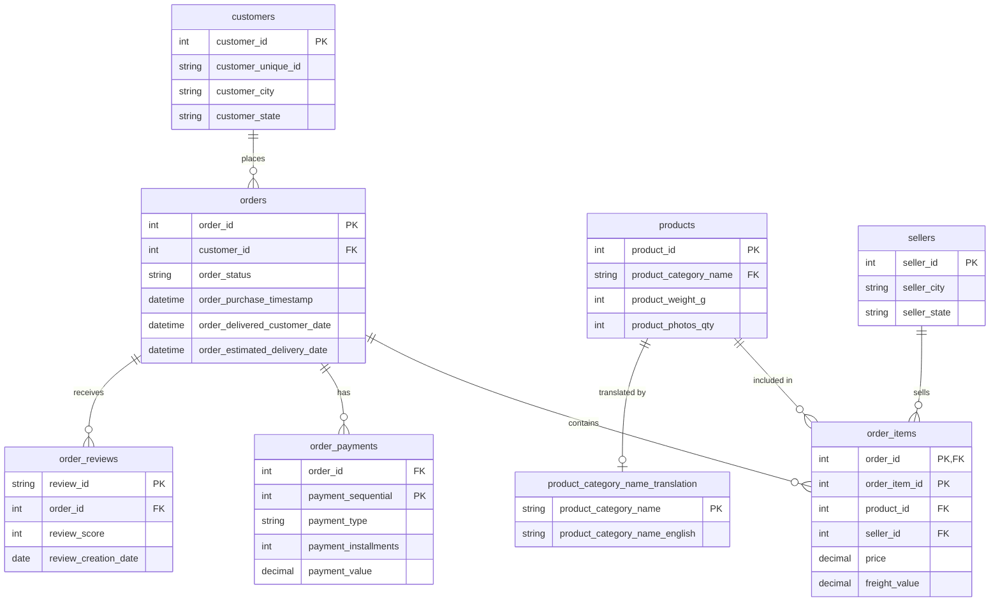

# Atelier 2 — Écrire des requêtes SQL

**Jour 1 · 14 h 30 – 15 h 30 · 60 minutes. Travail individuel. Un ordinateur.**
**Module de rattachement : module 3.**
**Outil : https://sqliteonline.com/ · Fichier : `olist-pedagogique.db`**

---

## Mise en route (5 minutes, à faire immédiatement)

1. Ouvrez https://sqliteonline.com/
2. Importez le fichier `olist-pedagogique.db` par le bouton d'ouverture de base de données (il accepte les fichiers `.db` et `.sqlite`).
3. Vérifiez que **les huit tables apparaissent** dans l'arborescence de gauche.
4. Exécutez cette requête de contrôle :

```sql
SELECT COUNT(*) FROM orders;
```

Vous devez obtenir **3 000**. Si ce n'est pas le cas, prévenez le formateur **tout de suite** : ne commencez pas les questions.

En cas d'échec de l'import du `.db`, utilisez le fichier de secours `olist-pedagogique.sql` via l'import de fichier `.sql`. C'est plus lent (une à deux minutes) et cela produit la même base.

---

## Le schéma



 **Remarque :** j’ai ajouté `seller_id FK` dans `order_items`, car la relation avec la table `sellers` apparaît implicitement dans ton modèle et elle est nécessaire pour relier les 8 tables.
```

**Effectifs à garder en tête :** 3 000 commandes, 3 418 lignes d'articles, 3 021 avis, 3 115 paiements, 975 vendeurs, 2 488 produits.

---

## Consignes générales

- Écrivez **une requête par question**, et conservez-les toutes dans un même fichier `.sql`, numérotées en commentaire (`-- Q1`).
- **Nommez vos colonnes de résultat** avec `AS`. Une colonne qui s'appelle `COUNT(*)` dans un livrable est une colonne mal nommée.
- Arrondissez les montants à deux décimales avec `ROUND(x, 2)`.
- Pour chaque question, **notez le résultat obtenu** en commentaire sous la requête. C'est ce qui permet de corriger.
- Vous n'avez pas le droit de coller une requête sans l'avoir exécutée et sans en avoir lu le résultat.

**Avertissement de méthode.** Trois questions sont volontairement difficiles (10, 11, 12). Si vous bloquez, passez à la suivante et revenez. Finir huit questions justes vaut mieux que douze approximatives.

---

## Niveau 1 — Lire et filtrer (10 minutes)

**Q1.** Combien de vendeurs distincts la base contient-elle ?

**Q2.** Combien d'articles vendus ont un prix strictement inférieur à 20 BRL ?

**Q3.** Quels sont les cinq états qui comptent le plus de **vendeurs** ? Affichez l'état et le nombre, du plus grand au plus petit.

---

## Niveau 2 — Agréger (13 minutes)

**Q4.** Combien de commandes ont été passées chaque mois de l'année **2018** ? Affichez le mois au format `AAAA-MM` et le nombre de commandes, triés par mois croissant.

*Indication : `substr(colonne, 1, 7)` extrait les sept premiers caractères d'une chaîne.*

**Q5.** Quelle est la **répartition des notes** d'avis ? Pour chaque note de 1 à 5, affichez le nombre d'avis et le pourcentage que cela représente sur le total des avis.

*Indication : pour un pourcentage, pensez à multiplier par `100.0` et non par `100`, sinon la division entière vous donnera 0.*

**Q6.** Pour les cinq états ayant le plus de commandes, quels sont les **frais de port moyens** par article ? Affichez l'état, le nombre de commandes distinctes et les frais de port moyens.

---

## Niveau 3 — Joindre (17 minutes)

**Q7.** Quelles sont les cinq **catégories de produits** qui génèrent le plus de chiffre d'affaires ? Le chiffre d'affaires d'un article est `price + freight_value`. Affichez le nom **anglais** de la catégorie et le chiffre d'affaires.

**Q8.** Quel est le chiffre d'affaires par **état du vendeur** ? Affichez les cinq premiers, avec le nombre d'articles vendus.

**Q9.** Combien de commandes contiennent des articles provenant de **plusieurs vendeurs différents** ?

*Indication : une sous-requête avec `GROUP BY` et `HAVING` fait l'affaire.*

---

## Niveau 4 — Les trois difficiles (15 minutes)

**Q10.** Quel est le **délai de livraison moyen**, en jours, pour chaque état ayant **au moins 100 commandes** ? Affichez l'état, le nombre de commandes et le délai moyen, du plus lent au plus rapide.

*Indication : `julianday(date_a) - julianday(date_b)` donne un nombre de jours.*

**Q11.** Les commandes dont le montant total dépasse **361,25 BRL** représentent quel **pourcentage du chiffre d'affaires** total ? Affichez aussi leur nombre.

*Indication : commencez par une sous-requête qui calcule le montant total de chaque commande, puis travaillez sur son résultat.*

**Q12.** Parmi les catégories de produits ayant reçu **au moins 50 avis**, quelles sont les **cinq moins bien notées** ? Affichez le nom anglais de la catégorie, le nombre d'avis et la note moyenne.

---

## Question de synthèse (5 minutes, à rédiger)

**Q13.** Regardez ensemble vos résultats des questions **3, 6 et 10**.

En **quatre phrases maximum**, rédigez ce qu'ils racontent lorsqu'on les met côte à côte : quel mécanisme économique ou logistique ces trois chiffres décrivent-ils ? Et quelle donnée absente de cette base vous permettrait de le confirmer ?

Cette question vaut autant de points que trois requêtes. Trouver un chiffre est un exercice ; comprendre ce que trois chiffres disent ensemble est le métier.

---

## Livrables

Un dossier à votre nom contenant :

1. **`atelier2-requetes.sql`** : les douze requêtes numérotées, chacune suivie de son résultat en commentaire.
2. **`atelier2-synthese.md`** : la réponse à la question 13.
3. **`USAGE-IA.md`** : selon le modèle en annexe.

## Annexe — Fichier `USAGE-IA.md` (obligatoire)

```markdown
# Usage de l'IA — Atelier 2
Nom :

## Avons-nous utilisé une IA ?
[oui / non]

## Si oui, pour chaque usage
### Usage 1
- Outil utilisé :
- Quand, à quel moment de l'atelier :
- Pourquoi : ce que nous cherchions à obtenir
- Ce que l'IA a répondu, en résumé :
- Ce que nous avons gardé, modifié, ou rejeté, et pour quelle raison :

## Réponses que nous avons refusées
- Réponse refusée :
- Motif du refus :

## Corrections que nous avons dû apporter
- Erreur ou approximation détectée dans une réponse de l'IA :
- Correction apportée :
```

**Avertissement particulier à cet atelier.** Une IA écrit volontiers une requête SQL syntaxiquement correcte et factuellement fausse sur cette base précise : elle ne sait pas que `order_items` contient 3 418 lignes pour 3 000 commandes, ni que 20 commandes ont reçu deux avis. Elle produira un chiffre plausible.

Toute requête livrée sans résultat exécuté, ou dont le résultat annoncé ne correspond pas à ce que la base renvoie, sera comptée comme fausse. Si vous faites écrire une requête par une IA, exécutez-la, lisez le résultat, vérifiez l'ordre de grandeur, et **consignez la correction que vous avez dû apporter**.

---

## Aide-mémoire

```sql
SELECT colonne1, AGREGAT(colonne2) AS nom_affiche
FROM table_a AS a
JOIN table_b AS b ON a.cle = b.cle
WHERE condition_sur_les_lignes
GROUP BY colonne1
HAVING condition_sur_les_groupes
ORDER BY nom_affiche DESC
LIMIT 5;
```

| Besoin | Écriture |
|---|---|
| Compter les lignes | `COUNT(*)` |
| Compter des valeurs différentes | `COUNT(DISTINCT colonne)` |
| Somme, moyenne, min, max | `SUM`, `AVG`, `MIN`, `MAX` |
| Arrondir | `ROUND(x, 2)` |
| Extraire le début d'un texte | `substr(colonne, 1, 7)` |
| Convertir une date en jours | `julianday(colonne)` |
| Condition à la volée | `CASE WHEN ... THEN ... ELSE ... END` |
| Valeur absente | `IS NULL` / `IS NOT NULL` |
